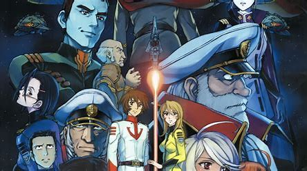

```{r setup, include=FALSE}
knitr::opts_chunk$set(echo = FALSE)
```

# Are you anime fan lover and do not know what to watch?
    
    Top 20 anime for 2012 overview
    
    
  The following list of anime are fom 2012 created by IMDb tv. The list is based on the most popular anime of 2012, the genres on this list are very broad. The following genres on these anime
 The following list of top anime comes from 2012 collection of most popular anime based on the information from IMDb. The anime genres that are in this following list is very versitile because it has sport anime, action anime, romance anime, etc.. I will include short overview of the anime to try to win you over to give one of these anime a try. 

{width=50}

# 1.JoJo's Bizzare Adventure

    Genre: Animation, Action, Adventure

  As the title suggests, JoJo’s Bizarre Adventure is one of the most amazingly bizarre shonen anime of all time that spans many excitingly different seasons. This anime is jam-packed with crazy action and iconic moments that are known to practically all of the anime community.
  
  source: CrunchyRoll
  
{width=50}

# 2. Sword Art Online

    Genre: Animation, Action, Adventure

  The battle for survival in this MMORPG gave SAO a very solid plot, at least for the first half of the series. Character motives and relationships were clear and each interaction created a different perspective of the lead character Kirito. His partner Asuna also displayed a strength not usually seen in female anime characters. But as soon as the second arc of this light novel adaptation began, the story and its characters begun to crumble. Asuna was cast to the sideline as a princess that needed saving and Kirito was “trapped” within the virtual world unable to face reality yet without Asuna.

Despite its weaknesses, SAO’s breathtaking scenery and fluid animation cannot be ignored. The first opening song, Crossing Field by Lisa, was a very memorable piece fit for the series. If not for the flaws of the second half of the series, SAO would have ranked better this year.
  
  Source: CrunchyRoll

{width=50}

# 3.Kurokos's Basketball

    Genre: Animation, Comedy, Sport

  I was never a fan of sports anime but Kuroko no Basket is such an enjoyable watch I could not afford to miss it! More than the basketball which I came to love because of this series, the character interactions – their teamwork, and all the moments in between felt real. So was the fact that no matter how hard we work on achieving something, we cannot always win. Let’s not forget how our lead characters can be such eye candies and even though the voice cast are not all well-known, they have done a great job of bringing to life each character.
  
  Source: AnimePlanet
  
{width=50}

# 4.Psycho-Pass

    Genre: Animation, Action, Crime

  Believing in humanity and order, policewoman Akane Tsunemori obeys the ruling, computerized, precognitive Sibyl System. But when she faces a criminal mastermind who can elude this "perfect" system, she questions both Sibyl and herself.

  Source: AnimePlanet
  
{width=50}

# 5.Another

    Genre: Animation, Drama, Horror

  When Kouichi Sakakibara (15) transfers to Yomiyama North Middle School, he senses something out of place in the atmosphere of a class that seems to be afraid of something. Kouichi is drawn to a mysterious girl, Mei Misaki, and tries to make contact with her, only to find more mysteries. As he does, the class is stricken by a disaster that nobody could have imagined! Just what is going on in this "world"?
  
  Source: Animeplanet

{width=50}

# 6.Magi: The labyrinth of Magic

    Genre: Animation, Action, Adventure

  Magi: The Labyrinth of Magic is full of adventure and wonder as you follow a young Alladin who comes upon an all-powerful djinn. The anime is a fun watch and has a surprising amount of action for those that are fans of shonen.
  
  Source: CrunchyRoll

{width=50}

# 7.Kamishama hajimemashita

    Genre: Animation, Comedy, Fantasy

  Nanami Momozono's dad skips town, she is then visited by debt collectors and kicked out of her home. So when a man offers her his home, she immediately accepts. The place is a shrine, and Nanami has unknowingly taken over his job as a local deity.

  Source: CrunchyRoll

{width=50}

# 8.K

    Genre: Animation, Action, Drama

  Japan has reclaimed its former glory under the guidance of Kings, charismatic individuals wielding incredible powers. But now, one of the Red King's vassals has been murdered, and a viral video shows the killer's confession at the scene. He is one Yashiro Isana, claiming to be the Colorless King; and he is now a wanted man - not only to the Red King's faction, but also the Blues charged with keeping the peace. He is even sought by Kuroh Yatogami, a knight of the former Colorless King sworn to slay any unworthy successor. Only, the subject of their struggle, "Shiro", is a nondescript young man living an unremarkable life in an island academy, and seems to have no recollection of killing anyone. To keep his life, Shiro must prove his innocence; but what is the truth behind his mysterious past, and what will be the outcome of this confrontation of Kings?

  Source: Forevergeek

{width=50}

# 9.Nisemonogatari

    Genre: Animation, Comedy, Drama

  With Oshino gone and school out for summer, Araragi heads into the break hoping to spend his time relaxing, working on his classwork with Hanekawa, hanging out with his girlfriend Senjogahara, and maybe even finding a little time to molest Hachikuji as he wanders the streets. But when his sisters get tangled up in investigating a ring of curses circulating their middle school, the boy finds himself once again involved with strange characters and unexplained oddities. With only his vampiric mistress Shinobu for help, will Koyomi Araragi be able to solve the strange mystery uncovered by his "Fire Sisters"?
  
  Source: IMDb

{width=50}

# 10.Joshiraku

    Genre: Animation, Comedy

  A joint effort between popular illustrator Yasu and KUMETA Kouji, creator of Sayonara Zetsubou Sensei, this manga features female rakugo storytellers. After stepping off the stage, these comedians chit-chat in the girl's dressing room. This is a comedy that begins after the storyteller has said goodbye to the audience!
  
  Source: IMDb

{width=50}

# 11.Star Blazers 2199
  The year is 2199. The human race has been crushed in their war with the Gamilos, driven into underground cities by the invader's assault. Scientists estimate they have only a year left. The young officers Susumu Kodai and Daisuke Shima receive a mysterious capsule from a ship that made an emergency landing on Mars and return with it to Earth. It contains humanity's last hope: the planet Iscandar on the other side of the Magellan Galaxy has the technology to defeat the Gamilos and restore the planet. The space battleship Yamato is entrusted with this task, but they have only one year before humanity ends.
  
  Source: CrunchyRoll

{width=50}

# 12.Girl und Panzer
  Forget track and field! At Oorai Girls Academy, they practice Shensha-do, the art of tank combat! But Miho transfers there believing it to be the one school where Shensa-do isn't offered. She's in for a rude awakening, however, when the student council president demands her participation in the sport. Together with four friends, she learns to face her fears, find herself, and have a whole lot of fun along the way. Get ready for tank fighting mayhem in Girls Und Panzer!
  
  Source: AnimePlanet

{width=50}

# 13.Nyaruko: Crawling with Love
  She is the malign deity "Crawling Chaos" Nyarlathotep, or Nyarko for short.
Together with "Living Flame" Cthuga, or Kuko, and "The Unspeakable One" Hastur, or Hasuta, they bring you an abysmally terrifying Love(craft) comedy!

Deities arrive on Earth one after another in search of Yasaka Mahiro and Nyaruko.
Nyaruko and her Space CQC take on all of them.
What is the truth behind these incidents of cosmic scale?
Will Mahiro be able to live in peace?

  Source: Forevergeek

{width=50}

# 14.Medaka Box
  The gorgeous, peerless student council president, Medaka Kurokami, solves everyone's problems! Medaka Kurokami, who has just become Sandbox Academy's 98th student council president, sets up a suggestion box as promised in her election campaign. "Your dreams belong to you. Go after them and make them come true yourself. Your worries, however, belong to me. Send them all my way!!" As Medaka solves her fellow students' problems along with her friend since childhood, Zenkichi Hitoyoshi, her suggestion box, nicknamed the Medaka Box, earns great popularity among the students.
  
  Source: IMDb

{width=50}

# 15.Zetman
  Jin is an energetic young boy living in a shanty town and making ends meet by performing good deeds for money. However, when his mentor dies during a fight with a strange monster he finally learns the meaning of death. Having been taken in by a stripper named Akemi whom he once saved, Jin begins to live a quiet and normal life - though in reality he is anything but ordinary. With superhuman abilities and a group of mysterious men searching for him under the name of Zet, over the years Jin finds himself drawn into a world of creatures with dangerous powers called "Players". But what is Jin really, and with his vicious methods of defeating these threats, is he really a hero for justice or simply another dangerous monster?
  
  Source: Forevergeek

{width=50}

# 16.Uchû kyôdai
  One evening two brothers see what appears to be a UFO in the sky. Whether or not that was the case becomes irrelevant, but it does spark an interest in space and the two brothers make a promise to go to space one day. Now, many years later, the younger brother Hibito is about to realize his dream, while the older brother Mutta just got fired from his job. After an aimless period in his life, his family helps re-ignite his fire and he becomes an applicant to the Japanese space agency in the hopes of making it up there some day.
  
  Source: Forevergeek

{width=50}

# 17.Aquarion EVOL
  Aquarion Evol (アクエリオンEVOL Akuerion Evoru) is the sequel to the 2005 anime series Genesis of Aquarion. It was originally announced on February 25, 2011, by the production staff. It premiered on TV Tokyo on January 8, 2012, as an hour-long special that combined the first two episodes in a single broadcast.
  
  Source: Animeplanet

{width=50}

# 18.Bodacious Space Pirates
  Marika is living the normal life of an average girl in space: attending her school's yacht club, keeping up with the latest trends, and working part time. One day can change a lot, however. Not only was her late father a notorious space pirate, he was also the Captain of the equally notorious Benten Maru! What's worse, she's just inherited his position and the pirate's life that comes with it.
  
  Source: CrunchyRoll

{width=50}

# 19.Terumae Romae
  Lucius, a Roman architect, is transported through time to modern-day Japan, where he learns about Japanese bathhouses and uses this to his gain back home.
  
  Source: IMDb

{width=50}

# 20.Wooser no Sono Higurashi
  Wooser is an adorable creature with a not-so-adorable fetish for panties and school girls. Alongside the lovely ladies Miho, Ren and Rin, Wooser always manages to have a fun time, whether the gang has a DJ dance party, forms sculptures out of clay or even volunteers at the zoo.
  
  Source: IMDb
