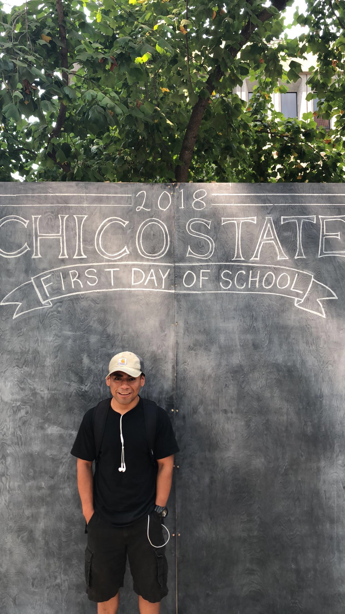

```{r setup, include=FALSE}
knitr::opts_chunk$set(echo = FALSE)


```

{width=300}

# About me: 

I love eating orange chicken and Sushi. I love cooking because my major had lots of labs which were about cooking. I enjoy going hiking, backpacking, camping. I like weightlifting on my free time.I am a very outgoing individual and I like challenging my self to learn new things in life. I love my current hobby at the moment which is R language it is very useful in real life because you can create artificial computer and look into data from different angles which makes it challenging and interesting.

# Education: 

My major is Nutrition Food Science with an emphasize in Management. I am currently a senoir at California State University Chico. I have done many projects from product development to Nutrionatl Education classes. I have been taught the right way to perform Motivational Interviews. I have been given the opportunity to be HACCP  Certified, Servsafe certified too. I have been given the opportunity to work with the CHC Data Science Team. They offered me an opportunity to Learn R language to do simple tasks like creating data, working with data to create tables, proportions. I was able to create graphs with the data this is very useful because making the data visual it makes it easier to look at the data.

# Internship: 

CHC Data Science Team, gave me the opportunity to be able to work with the Data they collected from the Project called CFHL (Cal-Fresh Healthy Living). This project collected data on classes that were given at different California University campuses 


